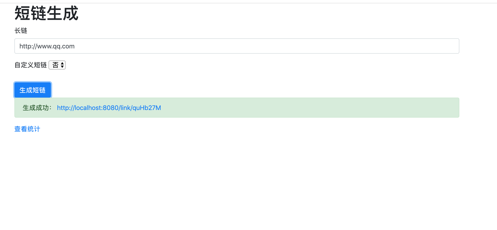
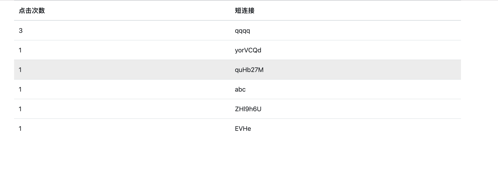

# 短连接生成工具

> 短网址（Short URL），顾名思义就是在形式上比较短的网址。在Web 2.0的今天，不得不说，这是一个潮流。目前已经有许多类似服务，借助短网址您可以用简短的网址替代原来冗长的网址，让使用者可以更容易的分享链接。
>
> 例如：http://t.cn/SzjPjA

# 关键词

* 长链接： 需要被访问的地址
* 短链接：长链接转换后的地址
* 短码：短链接后跟的唯一识别字符串

# 目前实现功能

- [x] 输入⻓链，生成短链
- [x] 访问短链，跳转到⻓链
- [x] 支持访问计数
- [x] 支持自定义短链，可以指定字符串作为短链的key 
- [x] 支持自定义字符集和长度和短连接域名以及自定义短连接的最长长度配置

# 技术选型

- [x] java
- [x] spring boot
- [x] redis
- [x] spring mvc

# 实现思路

## 自动生成短链接

首先将长连接做md5计算生成32位字符，然后根据配置的短码的长度对32位字符进行切分，例如短码为8位字符切分为8组4个字符的数据，然后对每一组数据取余运算，取自定义字符集的字符长度。最终确定取字符集中的索引。将8组取完后生成了最终的短码，例如: `abcedg12`

生成短码后，通过redis的hash结构往里面注入一条k-v结构数据，如果注入成功返回短码，如果注入失败需要判断redis中存在的数据它的长链接是否和本次要设置的长链接一致，如果不一致，可能发生了碰撞，此时直接取md5的数据取余字符集长度，来取出数据重试一次，如果还失败直接结束。

## 手动设置短链接

1. 检查用户配置的短码长度是否大于系统配置的最大长度，超过直接报错结束

2. 检查redis中是否存在，不存在就返回成功
3. 存在判断长链接是否一致，一致直接返回成功
4. 不一致提示用户短链接已被占用

## 效果

